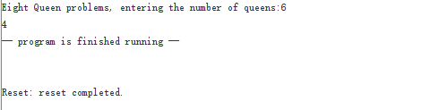

<h1 align = "center">数字逻辑第八次作业报告</h1>
<h5 align = "center">无58 吴昆 2015010625</h5>

## 一、排序sort
### 1. 代码
sort.asm  
```assembly
.data 0x10000000
.word -3,2,1,15,-1,8
.text
main:  ori  $a0,$0,0x1000
	   sll  $a0,$a0,16 #$a0存储data地址也就是数组起始地址
	   addi $a1,$0,6  #数组里有6个数
#sort函数两个参数v起始地址存储在$a0,n存储在$a1
sort:  addi $sp, $sp, -20
       sw   $ra, 16($sp)
       sw   $s3, 12($sp)
       sw   $s2, 8($sp)
       sw   $s1, 4($sp)
       sw   $s0, 0($sp)
	   move $s0, $zero    #循环初始化
loopbody1: bge  $s0,$a1, exit1 #$a1存储外循环次数n，$s0为外循环变量i
#内循环循环体
	       addi $s1, $s0,-1 #$s1存储内循环变量j，初始化为i-1
loopbody2: blt  $s1,0,loopbody1c
	       sll  $t1,$s1,2
	       add  $t1,$a0,$t1#仿照loop写法，计算v[j]地址存入$t1
	       lw   $t0,0($t1)#$t0=v[j]
	       lw   $t2,4($t1)#$t2=v[j+1]
           bgt  $t0,$t2,loopbody1c#内循环终止的第二个条件
	       move $a3,$s1
	       jal  swap
	       addi $s1,$s1,-1
	       j    loopbody2
loopbody1c:addi $s0,$s0,1
	       j    loopbody1
swap:  sll  $t1, $a3, 2 #a3存储变量k，a0存储v起始地址
	   add  $t1, $a0, $t1
	   lw   $t0, 0($t1)
	   lw   $t2, 4($t1)
	   sw   $t2, 0($t1)
	   sw   $t0, 4($t1)
	   jr   $ra
exit1: lw   $s0, 0($sp)
       lw   $s1, 4($sp)
       lw   $s2, 8($sp)
       lw   $s3, 12($sp)
       lw   $ra, 16($sp)
       addi $sp, $sp, 20
       jr   $ra

```
#2. 设计说明
上述代码兼有sort过程和测试，我们在0x10000000存储了6个数（数组），使用$a0和$a1分别存储数组起始地址和数组大小，运行结果在测试结果中进行阐述。严格意义上说，我们在完整地执行这个程序的任务（测试）时，全部过程只是排序，因此在exit1中不需要`jr $ra`操作，但考虑到sort过程的完整性没有去掉这一步。在别的程序中调用sort时，去掉main部分，完整的sort过程及其所需子过程是从sort段起始到exit1结束。  
main段准备$a0,$a1两个参数，正式的排序从sort开始到exit1退出，在sort段保存寄存器，loopbody1和loopbody2分别是外循环和内循环的操作和判定，loopbody1c是外循环变量增加并跳转至loopbody1起始。  
排序的核心操作是交换，在sort内循环，也就是loopbody2中会调用swap来进行数据的交换。  
接下来分章节阐述。
#3. 测试结果
如图所示，我们可以通过Data Segment来查看执行mips汇编程序过程中内存的变化。在执行完以后，我们看到0x10000000起始的六个4字节（int数据）发生了变化，并且从低地址到高地址数从大到小排列，因此正确完成了排序过程。  


#4. swap子过程及`jal`调用子过程
swap操作牵涉交换内存中的两个数，在mips处理器上从内存读取两个数后存到对方的地址，核心指令是`lw`和`sw`。  
从一个过程调用另一个过程，使用`jal`跳转到代码地址并设置`$ra`寄存器，以供子过程完成后`jr $ra`返回。为此，在子过程调用前需要保存`$ra`。sort过程较为简单，执行之初就保存了`$ra`。
#5. 寄存器的保存与恢复
在sort过程中，会使用到多个寄存器，为了使得sort过程的调用者可以正常工作，需要保存寄存器。  
sort段到loopbody1前做的主要就是保存调用者的寄存器（和初始化外循环变量），可以看到分别保存了`$s0-$s3`和`$ra`，其中`$s0-$s3`被称作Save Register，由被调用者保存，在save过程中起着作用，比如`$s0`就是外循环变量详见注释。  
`$ra`是用来跳转到子过程保存父过程代码地址（+4）以供跳回，由于需要调用swap过程所以需要保存。  
`$t0`等t开头的寄存器被称作temporary registers，在sort过程中也有使用，但没有保护，应该由调用sort者自己保护。
## 二、 八皇后8queen
### 1. 代码
8queen.asm
```mips
#8queen
#寄存器分配情况，
#$s0-Site[8]起始地址，$s1queen循环变量,
#$a0-$a2传递参数:$a0-n,$a1-QUEENS,$a2-iCounts,由于调用过程中不会修改n，$a0也顺便用作Valid的参数。对iCounts的计算直接存储在$a2，最后move到$v0返回
#$v0Valid和Queen返回值、系统调用
#$t0-$t6Valid计算所用:$t0循环变量
.data 0x10000000
.word 0,0,0,0,0,0,0,0 #Site[8]
str:
  	.asciiz "Eight Queen problems, entering the number of queens:"
.text
init:   ori $s0,$zero,0x1000 
		sll $s0,$s0,16  #$s0存储Site[8]起始地址
        j main
valid:  li $t0,0 #循环变量i存储在临时寄存器$t0里，因为不会调用其它过程来破坏寄存器
		sll $t1,$a0,2
		add $t1,$s0,$t1#$t1存储Site[n]地址
		lw $t2,0($t1) #$t2存储Site[n]
		sub $t3,$zero,$t2#$t3存储-Site[n]
valid_lp:  bge $t0,$a0,valid_end
		   sll $t1,$t0,2
		   add $t1,$s0,$t1#$t1存储Site[n]地址
		   lw $t4,0($t1)#$t4存储SIte[i]
		   beq $t2,$t4,valid_nend#if(Site[i]==Site[n]) return 0;
		   add $t5,$t4,$t3 #$t5=Site[i]-Site[n]
		   abs $t5,$t5 #$t5=abs(Site[i]-Site[n])
		   sub $t6,$zero,$t0#$t6=-i
		   add $t6,$a0,$t6#$t6=n-i
		   beq $t5,$t6,valid_nend#if(abs(Site[i] - Site[n]) == (n - i)) return 0;
		   addi $t0,$t0,1
		   j valid_lp
valid_nend:li $v0,0
	       jr $ra
valid_end: li $v0,1
	       jr $ra
	
queen:  bne  $a0,$a1,queen_lpi #Queen函数的三个参数$a0代表n，$a1代表QUEENS,$a2代表iCount，返回值在$v0
		addi $a2,$a2,1
		move $v0,$a2
		jr $ra
queen_lpi:addi $sp,$sp,-4
          sw $s1,0($sp)#存储$s1到栈，因为会被占用
		  li $s1,1 #$s1存储循环变量i
queen_lp: bgt $s1,$a1,queen_end
		  sll $t0,$a0,2 #计算Site偏移量n
		  add $t0,$s0,$t0
		  sw $s1, 0($t0) #Site[n]=i;
		  addi $sp,$sp,-4#调用过程前保存$ra
		  sw $ra,0($sp)
	      jal valid
	      lw $ra,0($sp)
	      addi $sp,$sp,4#用完退栈，下同
	      beq $v0,0,queen_lp2
queen_rc: addi $sp,$sp,-12#这里是Valid(n)==True执行的代码，递归调用Queen
	      sw $ra,8($sp)#须保护$a0-$a2,$s1,$ra，$s1由被调用者保护，$a0就是加减1免去sw,lw
	      sw $a2,4($sp)
	      #sw $a0,0($sp)
	      addi $a0,$a0,1
	      jal queen
	      lw $ra,8($sp)
		  lw $a2,4($sp)
	      addi $a0,$a0,-1
	      #lw $a0,0($sp)#改成减1，其实这条指令去掉后可以把上面的4和8改成0和4，减小栈的大小
	      move $a2,$v0
	      addi $sp,$sp,12
queen_lp2:addi $s1,$s1,1
	      j queen_lp	  
queen_end:lw $s1,0($sp)
	      addi $sp,$sp,4
	      move $v0,$a2
	      jr $ra

main:	la	$a0, str
		li 	$v0, 4
		syscall			# print string
		li      $v0, 5
		syscall		#readint,存储在v0中
		move    $a0,$zero#设置Queen参数
		move    $a1,$v0
		move    $a2,$zero#iCount就是0且在此后不被调用不被修改，忽略掉了
		jal queen
		move $a0,$v0
		li $v0,1
		syscall #print int
		li	$v0, 10
		syscall			# exit
```
### 2. 设计
init段设置$s0为Site起始地址后跳转到main。main进行系统调用打印提示字符串、得到输入以及输出，调用queen来进行计算。queen_lpi,queen_lp,queen_lpc构成了循环的框架，分别是循环初始化、循环前段和循环后段，夹在其中的queen_rc是用来做递归调用queen及之前之后对寄存器的保存和复原操作。  
valid_lp是valid过程的主循环，valid_nend和valid_end分别是返回0和返回1的结束代码，根据valid执行过程中不同的判定结果选择性地跳转到这两个段进而产生不同的返回值。
### 3. 测试结果
分别测试了输入为5、6、8的情况，由C语言程序得到对应正确结果分别为10，4，92；测试汇编语言结果，果不其然都是对的。  
输入为5：  
  
输入为6：  
  
输入为8：  
  
### 4. 寄存器分配情况
`$s0`：对应&Site（Site[8]起始地址），`$s1`：对应`queen`循环变量,
`$a0-$a2`传递参数，其中`$a0`：对应`n`,`$a1`：对应`QUEENS`,`$a2`：对应`iCounts`,由于调用过程中不会修改n，`$a0`也顺便用作Valid的参数。对`iCounts`的计算直接存储在`$a2`，最后`move`到`$v0`返回
`$v0`：Valid和Queen返回值、系统调用
`$t0-$t6`Valid计算过程中会使用到，其中`$t0`：循环变量i
### 5. 寄存器保护情况
在调用子过程swap及递归中，都牵涉到寄存器的保护；此外，最外面调用queen本身的调用者寄存器也需要得到保护。  
首先，`$a0-$a2`这些参数寄存器显然在调用前就要赋值为相应的调用过程的参数，所以自然应该由调用者保护，在递归调用queen之前建栈的一个原因就是存储`$a2`，另一方面，也要保存`$ra`，因为跳转到新的过程需要跳转回，依据的就是`jal`设置的`$ra`值。  
由于queen需要使用`$s1`做环境变量，在一开始时就做了保存，在递归调用queen时它保护了上级queen的这个寄存器，没有发生问题。在递归调用时谁保存谁是一个比较难想的问题。
### 5. 复原寄存器与建栈与退栈
栈往低方向生长，当需要存储寄存器值时，先移动`$sp`指针，再根据相对位置`sw`存储各寄存器；调用完指令复原寄存器时，先按照相对位置`lw`读取各寄存器值，再正偏移量移动`$sp`指针。
### 6. 优化
指令中单次用时最多的显然是`sw`和`lw`指令，通过分析寄存器，减少了递归调用queen过程的寄存器存储数量，对于`$a0`改成简单的加减1，而`$a1`不做保存；在调用valid时，由于`$a0`与queen过程`$a0`一样且前者不会改变`$a0`值就不再保存，类似于C语言中的`const`变量。  

## 三、实验心得
1. 通过这个实验，巩固了MIPS指令，尤其是其中的跳转、分支和`lw`,`sw`指令。
2. 对于汇编语言中调用过程有了更深的理解，牵涉到调用前后寄存器的保存，栈指针操作，跳转指令。
3. 程序使用递归实现，一个思考难点是寄存器的保存问题，而调用swap子过程也需要考虑寄存器的保存。哪些是需要的，哪些是不需要的，分别由谁来保存。在这个实验中，swap需要用到比较多的寄存器，把他们全部用temporary registers来搞定，而queen过程不需要那么多寄存器，因此temporary registers就不需要保存，减小了设计的难度。  
`$a0`-`$a2`中的`$a0`对应的`n`在调用过程中不会修改，valid过程也要用，就不保存传入了，有一点C语言`const`的味道，说明C语言设计的时候还是很底层，有着浓浓的汇编语言的习惯。
4. 下一步值得深入研究的问题，一个是寄存器保存的convention，上课已经讲过，可以比较MIPS和X86的保存惯例来分析设计的思想。第二个是`syscall`，这是一个牵涉到CPU和操作系统的过程，应该在调用时陷入内核态，由操作系统建立向量表来对各种情况进行相应的操作，而CPU在遇到这条指令时做的事情本身又是死的，应该只是跳转到一个固定的地址？这中间的配合就很复杂。第三个是利用空间和时间局部性来进一步优化程序性能。